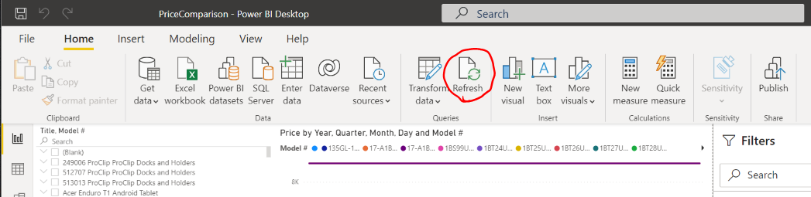
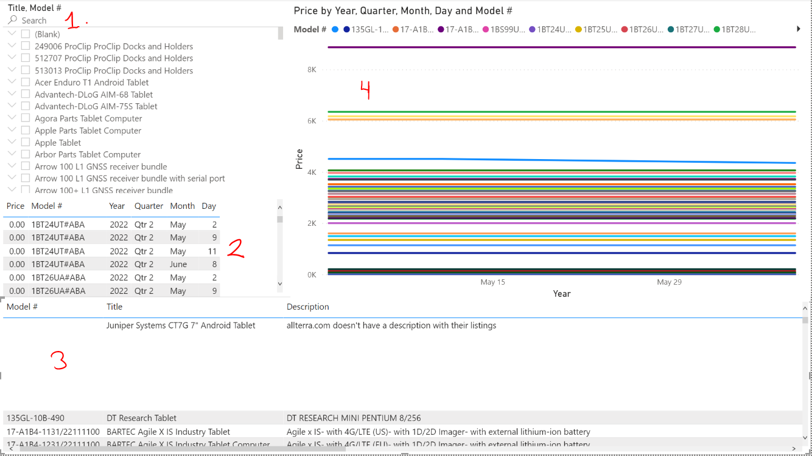

# User Manual: Juniper System Web Scrapping Program

## Purpose:
The purpose of this document is explain the entire process for using the web scrapping program. 

## Outline:
1. Scrape the websites for product and prices data
2. Repack the data to be used with Power BI
3. Refresh the Power BI report
4. Understanding the Power BI report

##  Scrape the Website for Product and Price Data:
The first step in using this system is to scrape the websites for the product and price data.

The script: `webscrape.py` will complete this step. 
It is run with no arguments and the entire line on the command line
will look like this: `$ python webscrape.py`

The websites that will be scraped are: 
1. BarcodeGiant.com
2. BarcodesInc.com
3. Allterra.com
4. CDW.com
5. Fondriest.com

The output of this script is a CSV file: `web_scrap_all_DATA.csv`

Watching the printout from the script for error statements is important. 
When the websites update their format, errors will occur and no data will be caught from that website.
It is also important to know that the script will not crash due to these types of errors.
* When a particular website starts giving an error, the script for that module will need to be updated. 
* See the design document for details to update that script.

## Repack the Data to be used with Power BI:
The next step in this system is to add the CSV file generated in the last step to the database that is used by the Power BI report.

The script: `priceComparison.py` will complete this step. It has 3 arguments:
1. The file used as the pricing database (`priceCompare.csv`) for the Power BI report.
2. The file used as the product database (`deviceInfo.csv`) for the Power BI report.
3. The CSV file that was generated by `webscrape.py` and will be added to the Power BI database.

The entire line on the command line should look like this:
* `$ python priceComparison.py priceCompare.csv deviceInfo.csv web_scrap_all_DATA.csv`

The output of this script is an updated `priceCompare.csv` and `deviceInfo.csv`

## Refresh the Power BI Report:
In Power BI report, click the refresh button to pull the new data in.

## Understanding the Power BI Report:
There are 4 tiles in the report:
1. The model field is searchable and allows you to select a single model that will be shown in the other fields.
2. The pricing chart shows the price for dates for each model selected.
3. The description chart shows the details behind the model that is selected.
4. The pricing graph shows the price for dates for each model selected.

